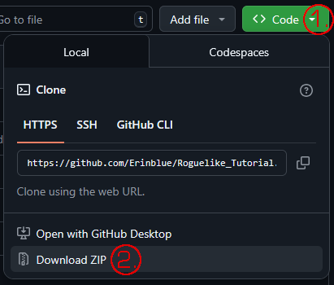

# Crypts of the Embered

**Crypts of the Embered** es un Roguelike Tradicional basado en el [tutorial](https://rogueliketutorials.com/tutorials/tcod/v2/) para Python.

## Instalación

## Manual/Cómo Jugar

### Objetivo del juego
Adentrarse a fondo en la mazmorra para encontrar el mítico **Amuleto de Yendor**.

### 1. Control.

| Dirección/Acción | Teclas |
| --- | --- |
| ← | `Izquierda`, `h` |
| ↓ | `Abajo`, `j` |
| ↑ | `Arriba`, `k` |
| → | `Derecha`, `l` |
| Confirmar | `Enter`, `Retroceso` |
| Salir/Cancelar | `Escape` |
| Coger objeto | `g` |
| Esperar/Pasar turno | `5`, `.` |

* Teclado numérico.

| Dirección | Tecla |
| :---: | :---: |
| `7` `8` `9` `4` `5` `6` `1` `2` `3` | `↖` `↑` `↗` `←` `E` `→` `↙` `↓` `↘` |

### 2. Menús.

| Menú | Tecla |
| --- | --- |
| Inventario | `i` |
| Soltar objeto | `d` |
| Historial | `v` |
| Personaje | `c` |
| Inspeccionar | `/` |

Para usar o soltar un objeto dentro de los menús Inventario o Soltar objeto, o dentro de cualquier otro menú, pulsa la tecla que aparece a su lado entre paréntesis. Por ejemplo:
 `(a) Poción de Salud` En este caso habría que pulsar `a`.

Para Equipar os Quitar un objeto, úsalo desde el inventario. Los objetos equipados tienen una `E` mayúscula a su derecha.

* Teclas adicionales.

Mantener `Mayús`, `Ctrl` o `Alt` hace avanzar más casillas en los menús, como el historial o al seleccionar un objetivo.

`Mayús`: 5 casillas. 
`Ctrl`: 10 casillas. 
`Alt`: 20 casillas.
